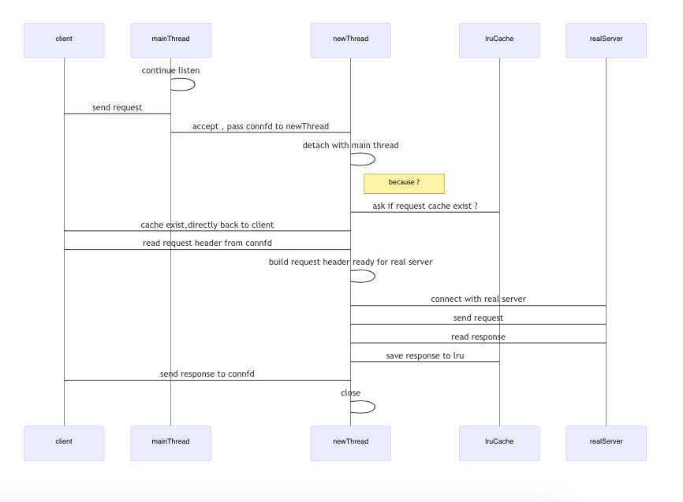
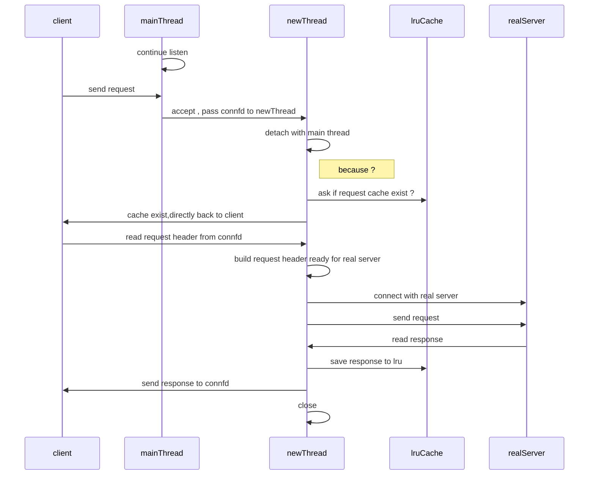

# proxy lab 总结

# part1 + part2

- Proxy lab 的难度适中 , 流程比较清晰 , 但是字符串操作 , 使用到的函数和结构体比较多
- 先把tiny server 的代码理清楚
- 书本最后三章
- 线程创建后需要 detach ,保证可以被系统自动回收
- 用书本 p703 提供的 [sbuf code](http://csapp.cs.cmu.edu/3e/code.html) , 类似 go buffered channel 功能
- 监听描述符和连接描述符 , 子进程会有父进程连接描述符的副本(实际占用两份空间)  , 要在子进程里把连接描述符close掉
- 书里关于描述符表和文件表的图很重要(好像是shell lab那几章) *****
- 大端小端,知道有这个区别就好 , 平时也接触不到
- 三个模型的优劣
  - 多进程
  - IO多路复用
  - 多线程
- 描述符的数据结构
- 输入输出流,格式化,重定向

# 资料
[recitation](https://www.youtube.com/watch?v=eQNhD7w7XrY&t=3s)
csapp 第三版后三章
参考 tiny 目录的 tiny httpserver
http://csapp.cs.cmu.edu/3e/labs.html

# 整体流程图

